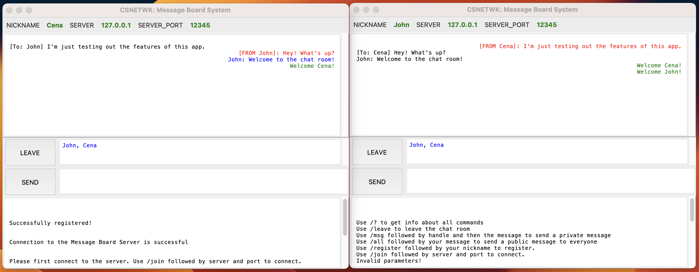

# UDP Chat Application
A GUI Message Board System built using Python and Tkinter.

My machine project submission for the final output of the course, Introduction to Computer Networks (CSNETWK).

## To Run the App
- Start `server.py` through the command line.
- Run as many separate instances of `clientUI.py` as you want, one instance per user.

## Commands
- `/?` - to get info about all commands.
- `/join <server> <port>` - to join a server.
- `/register <handle>` - to register your desired username.
- `/msg <handle> <message>` - to send a private message to a user.
- `/all <message>` - to send a message to the public board.
- `/leave` - to leave the chat room.

## Project Description
A Python chat application allowing clients to be able to communicate with other clients through the server using the UDP protocol. 
The Message Board System is comprised of a server application and a client application.

